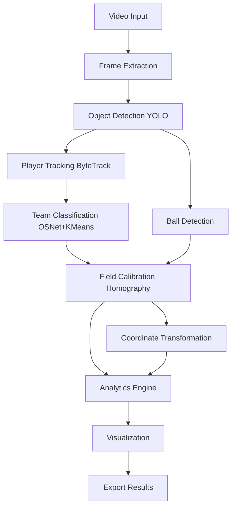

# 🏈 GUÍA COMPLETA DEL PROYECTO FOOTBALL ANALYTICS

## 📋 ÍNDICE
1. [Visión General del Sistema](#visión-general-del-sistema)
2. [Arquitectura del Proyecto](#arquitectura-del-proyecto)
3. [Módulos Principales](#módulos-principales)
4. [Pipeline de Procesamiento](#pipeline-de-procesamiento)
5. [Tecnologías y Algoritmos](#tecnologías-y-algoritmos)
6. [Configuración y Uso](#configuración-y-uso)
7. [Scripts Principales](#scripts-principales)
8. [Estructura de Datos](#estructura-de-datos)
9. [Guía de Instalación](#guía-de-instalación)
10. [Ejemplos de Uso](#ejemplos-de-uso)

---

## 🎯 VISIÓN GENERAL DEL SISTEMA

**Football Analytics** es un sistema completo de análisis de video de fútbol en tiempo real que procesa videos de partidos y genera datos útiles para análisis de rendimiento de jugadores y equipos.

### ✨ Características Principales:
- **Detección de Objetos**: Detecta jugadores, porteros, árbitros y balón usando YOLO
- **Seguimiento Persistente**: Tracking de jugadores con ByteTrack
- **Clasificación de Equipos**: Asignación automática usando OSNet + K-means
- **Calibración de Campo**: Transformación automática de coordenadas pixel → campo real
- **Visualización en Tiempo Real**: Overlays de video y mapa táctico 2D
- **Análisis Avanzado**: Trayectorias, velocidades, mapas de calor, estadísticas
- **Exportación de Datos**: JSON, CSV, videos anotados

---

## 🏗️ ARQUITECTURA DEL PROYECTO

```
football_analytics/
├── 🧠 core/                    # Núcleo del sistema
│   ├── models.py              # Modelos de datos (Detection, TrackedObject)
│   ├── config.py              # Gestión de configuración
│   ├── interfaces.py          # Interfaces abstractas
│   ├── video_processor.py     # Orquestador principal
│   ├── factory.py             # Factory de componentes
│   └── exceptions.py          # Excepciones personalizadas
│
├── 🔍 detection/              # Detección de objetos
│   ├── object_detector.py     # Detector YOLO para jugadores/balón
│   └── field_detector.py     # Detector de líneas del campo
│
├── 🎯 tracking/               # Seguimiento de objetos
│   └── player_tracker.py     # Tracker ByteTrack para jugadores
│
├── 🏷️ classification/         # Clasificación de equipos
│   └── team_classifier.py    # OSNet + K-means para equipos
│
├── 📐 calibration/            # Calibración del campo
│   ├── field_calibrator.py   # Calibración con homografía
│   ├── hybrid_calibrator.py  # Calibrador híbrido
│   └── fallback_calibrator.py # Calibrador de respaldo
│
├── 📊 analytics/              # Motor de análisis
│   └── engine.py             # Estadísticas y métricas
│
├── 🎨 visualization/          # Visualización
│   ├── visualizer.py         # Overlays de video
│   ├── field_map.py          # Mapa táctico 2D
│   └── visualization_manager.py # Gestor de visualización
│
├── 📤 export/                 # Exportación de datos
│   ├── data_exporter.py      # Exportador JSON/CSV
│   └── report_generator.py   # Generador de reportes
│
├── 💻 cli/                    # Interfaz de línea de comandos
│   ├── main.py               # CLI principal
│   └── commands.py           # Comandos CLI
│
└── 🛠️ utils/                  # Utilidades
    └── helpers.py            # Funciones auxiliares
```

---

## 🔧 MÓDULOS PRINCIPALES

### 1. 🧠 **Core (Núcleo)**

**Propósito**: Contiene las interfaces, modelos de datos y configuración central del sistema.

**Archivos clave**:
- `models.py`: Define las estructuras de datos principales
- `config.py`: Gestión de configuración con validación
- `video_processor.py`: Orquestador principal del pipeline
- `interfaces.py`: Interfaces abstractas para todos los componentes

**Modelos de datos principales**:
```python
@dataclass
class Detection:
    bbox: Tuple[int, int, int, int]  # x1, y1, x2, y2
    confidence: float
    class_id: int
    class_name: str

@dataclass
class TrackedObject:
    track_id: int
    detection: Detection
    team_id: Optional[int] = None
    field_position: Optional[Tuple[float, float]] = None
    trajectory: Optional[List[Tuple[float, float]]] = None
```

### 2. 🔍 **Detection (Detección)**

**Propósito**: Detecta objetos en cada frame del video.

**Componentes**:
- **ObjectDetector**: Usa modelos YOLO para detectar jugadores, porteros, árbitros y balón
- **FieldDetector**: Detecta líneas del campo y puntos clave

**Tecnología**: 
- YOLO v8 (Ultralytics)
- Modelos pre-entrenados específicos para fútbol
- Filtrado por confianza y NMS (Non-Maximum Suppression)

**Clases detectadas**:
- `player`: Jugadores de campo
- `goalkeeper`: Porteros
- `referee`: Árbitros
- `ball`: Balón

### 3. 🎯 **Tracking (Seguimiento)**

**Propósito**: Mantiene identidades persistentes de jugadores a través de frames.

**Componente principal**: `PlayerTracker`

**Tecnología**: 
- **ByteTrack**: Algoritmo de tracking multi-objeto
- Kalman filters para predicción de movimiento
- Asociación de detecciones con tracks existentes
- Gestión de aparición/desaparición de jugadores

**Características**:
- IDs persistentes para jugadores
- Predicción de posiciones futuras
- Manejo de oclusiones temporales
- Cálculo de trayectorias y velocidades

### 4. 🏷️ **Classification (Clasificación de Equipos)**

**Propósito**: Asigna jugadores a equipos basándose en características visuales.

**Componente**: `TeamClassifier`

**Pipeline de clasificación**:
1. **Extracción de crops**: Recorta imagen de cada jugador
2. **Generación de embeddings**: Usa OSNet para extraer características
3. **Clustering**: K-means para agrupar en equipos
4. **Asignación consistente**: Mantiene asignaciones estables

**Tecnologías**:
- **OSNet (One-Shot Network)**: Red neuronal para re-identificación
- **K-means clustering**: Agrupación no supervisada
- **Análisis de colores**: Detección automática de colores de uniformes

**Modelos soportados**:
- OSNet (recomendado)
- ResNet50
- DINOv2

### 5. 📐 **Calibration (Calibración del Campo)**

**Propósito**: Establece correspondencia entre coordenadas de píxeles y coordenadas reales del campo.

**Componentes**:
- **FieldCalibrator**: Calibración basada en líneas detectadas
- **HybridCalibrator**: Combina múltiples métodos
- **FallbackCalibrator**: Calibración de respaldo

**Proceso de calibración**:
1. **Detección de líneas**: Identifica líneas del campo (laterales, de gol, central)
2. **Estimación de esquinas**: Calcula esquinas del campo visible
3. **Cálculo de homografía**: Matriz de transformación 3x3
4. **Validación**: Verifica la calidad de la calibración

**Tecnología**:
- **Transformación homográfica**: Mapeo perspectivo
- **Detección de líneas Hough**: OpenCV HoughLinesP
- **RANSAC**: Estimación robusta de homografía
- **Filtros morfológicos**: Mejora de detección de líneas

### 6. 📊 **Analytics (Análisis)**

**Propósito**: Genera estadísticas y métricas de rendimiento.

**Componente**: `AnalyticsEngine`

**Métricas calculadas**:
- **Por jugador**: Distancia recorrida, velocidad máxima/promedio, posiciones
- **Por equipo**: Formación, centro de masa, dispersión
- **Generales**: Mapas de calor, posesión, estadísticas de partido

**Estructuras de datos**:
```python
@dataclass
class PlayerStats:
    player_id: int
    team_id: int
    total_distance: float
    max_velocity: float
    positions: List[Tuple[float, float]]

@dataclass
class TeamStats:
    team_id: int
    formation_center: Tuple[float, float]
    formation_spread: float
    possession_time: float
```

### 7. 🎨 **Visualization (Visualización)**

**Propósito**: Renderiza overlays visuales y mapas tácticos.

**Componentes**:
- **Visualizer**: Overlays en video principal
- **FieldMap**: Mapa táctico 2D
- **VisualizationManager**: Coordina todas las visualizaciones

**Tipos de visualización**:
- **Bounding boxes**: Con colores por equipo
- **IDs de jugadores**: Etiquetas persistentes
- **Trayectorias**: Caminos de movimiento
- **Mapa táctico**: Vista aérea 2D del campo
- **Información de estado**: Contadores, estadísticas

### 8. 📤 **Export (Exportación)**

**Propósito**: Exporta datos y resultados en múltiples formatos.

**Componentes**:
- **DataExporter**: Exportación JSON/CSV
- **ReportGenerator**: Generación de reportes

**Formatos soportados**:
- **JSON**: Datos estructurados completos
- **CSV**: Datos tabulares para análisis
- **MP4**: Videos anotados
- **Reportes HTML**: Visualizaciones interactivas

---

## 🔄 PIPELINE DE PROCESAMIENTO

### Flujo Principal:



### Procesamiento por Frame:

1. **📥 Input**: Frame de video (1920x1080)
2. **🔍 Detection**: YOLO detecta objetos → Lista de `Detection`
3. **🎯 Tracking**: ByteTrack asocia detecciones → Lista de `TrackedObject`
4. **🏷️ Classification**: OSNet+K-means asigna equipos → `team_id` actualizado
5. **📐 Calibration**: Homografía transforma coordenadas → `field_position`
6. **📊 Analytics**: Calcula estadísticas → `PlayerStats`, `TeamStats`
7. **🎨 Visualization**: Renderiza overlays → Frame anotado
8. **📤 Export**: Guarda resultados → JSON/CSV/Video

---

## 🧪 TECNOLOGÍAS Y ALGORITMOS

### 🔍 **Detección de Objetos**
- **YOLO v8**: "You Only Look Once" - Detección en tiempo real
- **Arquitectura**: Red neuronal convolucional
- **Entrenamiento**: Modelos pre-entrenados en datasets de fútbol
- **Post-procesamiento**: NMS para eliminar detecciones duplicadas

### 🎯 **Seguimiento Multi-Objeto**
- **ByteTrack**: Algoritmo estado del arte para MOT (Multi-Object Tracking)
- **Kalman Filter**: Predicción de estados futuros
- **Asociación de datos**: Hungarian algorithm para matching
- **Gestión de ciclo de vida**: Creación/eliminación de tracks

### 🏷️ **Clasificación de Equipos**
- **OSNet**: One-Shot Network para re-identificación de personas
- **Embeddings**: Vectores de 512 dimensiones
- **K-means**: Clustering no supervisado para 2 equipos
- **Consistencia temporal**: Suavizado de asignaciones

### 📐 **Calibración de Campo**
- **Homografía**: Transformación proyectiva 2D
- **Detección de líneas**: Hough Transform
- **RANSAC**: Estimación robusta de parámetros
- **Validación geométrica**: Verificación de coherencia

### 📊 **Análisis de Datos**
- **Cálculo de velocidades**: Derivada numérica de posiciones
- **Mapas de calor**: Histogramas 2D de posiciones
- **Análisis de formaciones**: Clustering espacial
- **Estadísticas temporales**: Agregación por ventanas de tiempo

---

## ⚙️ CONFIGURACIÓN Y USO

### 📁 **Archivo de Configuración** (`config.yaml`)

```yaml
processing:
  confidence_threshold: 0.5      # Umbral de confianza para detecciones
  nms_threshold: 0.4            # Umbral para Non-Maximum Suppression
  device: "cuda"                # Dispositivo: cuda/cpu/auto
  n_teams: 2                    # Número de equipos
  embedding_model: "osnet"      # Modelo para embeddings: osnet/resnet50/dinov2

field_dimensions:
  length: 105.0                 # Longitud del campo (metros)
  width: 68.0                   # Ancho del campo (metros)
  goal_width: 7.32             # Ancho de la portería
  goal_height: 2.44            # Alto de la portería

model_paths:
  yolo_player_model: "models/yolov8n-football.pt"
  field_lines_model: "models/SV_lines"
  field_keypoints_model: "models/SV_kp"

tracker_config:
  track_thresh: 0.5            # Umbral para tracking
  track_buffer: 30             # Buffer de frames para tracks
  match_thresh: 0.8            # Umbral para matching
  frame_rate: 30               # FPS del video

visualization:
  enable_2d_visualization: true
  enable_trajectory_visualization: true
  team_colors:
    0: [255, 100, 100]         # Color equipo 0 (BGR)
    1: [100, 100, 255]         # Color equipo 1 (BGR)
  bbox_thickness: 2
  trajectory_length: 50

export:
  output_dir: "exports"
  export_json: true
  export_csv: true
  export_video: true
```

### 🖥️ **Uso por CLI**

```bash
# Procesar video con configuración por defecto
football-analytics process video.mp4

# Procesar con parámetros personalizados
football-analytics process video.mp4 --confidence 0.7 --output results.mp4

# Procesar con 3 equipos
football-analytics process video.mp4 --teams 3

# Mostrar configuración actual
football-analytics config show

# Mostrar información del sistema
football-analytics info
```

### 🐍 **Uso Programático**

```python
from football_analytics.core import ConfigManager
from football_analytics.core.video_processor import VideoProcessor

# Cargar configuración
config_manager = ConfigManager()
config_manager.load_config("config.yaml")

# Crear procesador
processor = VideoProcessor(config_manager)

# Procesar video
results = processor.process_video("input.mp4", "output.mp4")

# Acceder a resultados
for frame_result in results.frame_results:
    print(f"Frame {frame_result.frame_id}: {len(frame_result.tracked_objects)} jugadores")
```

---

## 📜 SCRIPTS PRINCIPALES

### 1. **`analisis_completo_video.py`** - Script Principal
**Propósito**: Análisis completo de video con 3 salidas
**Salidas**:
- `video_anotado.mp4`: Video con overlays de jugadores y equipos
- `video_debug_lineas.mp4`: Video con líneas detectadas para calibración
- `video_mapa_tactico.mp4`: Mapa táctico 2D

**Uso**:
```bash
python analisis_completo_video.py
```

### 2. **Scripts de Verificación**
- `debug_team_classification.py`: Debug detallado de clasificación
- `verificar_equipos_video.py`: Verificar video principal
- `verificar_mapa_tactico.py`: Verificar mapa táctico

### 3. **Scripts de Testing**
- `test_video_simple.py`: Test básico de detección
- `test_team_classifier.py`: Test de clasificación de equipos
- `test_field_calibration.py`: Test de calibración

---

## 📊 ESTRUCTURA DE DATOS

### **Detection** (Detección)
```python
Detection(
    bbox=(x1, y1, x2, y2),      # Coordenadas del bounding box
    confidence=0.85,             # Confianza de la detección
    class_id=2,                  # ID de la clase
    class_name="player"          # Nombre de la clase
)
```

### **TrackedObject** (Objeto Rastreado)
```python
TrackedObject(
    track_id=1,                  # ID único persistente
    detection=detection,         # Detección asociada
    team_id=0,                   # ID del equipo (0 o 1)
    field_position=(52.5, 34.0), # Posición en el campo (metros)
    trajectory=[(x1,y1), (x2,y2)] # Historial de posiciones
)
```

### **FrameResults** (Resultados por Frame)
```python
FrameResults(
    frame_id=100,                # Número de frame
    timestamp=4.16,              # Tiempo en segundos
    tracked_objects=[...],       # Lista de objetos rastreados
    ball_position=(960, 540),    # Posición del balón
    is_calibrated=True,          # Estado de calibración
    homography_matrix=matrix     # Matriz de homografía
)
```

---

## 🛠️ GUÍA DE INSTALACIÓN

### **Requisitos del Sistema**
- Python 3.8+
- CUDA 11.0+ (opcional, para GPU)
- 8GB RAM mínimo (16GB recomendado)
- 2GB espacio en disco

### **Instalación**

1. **Clonar repositorio**:
```bash
git clone <repository-url>
cd football_analytics
```

2. **Crear entorno virtual**:
```bash
python -m venv venv
source venv/bin/activate  # Linux/Mac
# o
venv\Scripts\activate     # Windows
```

3. **Instalar dependencias**:
```bash
pip install -r requirements.txt
```

4. **Descargar modelos**:
```bash
# Crear directorio de modelos
mkdir models

# Descargar modelo YOLO
wget https://github.com/ultralytics/assets/releases/download/v0.0.0/yolov8n.pt -O models/yolov8n-football.pt
```

5. **Verificar instalación**:
```bash
python -c "import football_analytics; print('✅ Instalación exitosa')"
```

### **Dependencias Principales**
```
torch>=1.9.0
torchvision>=0.10.0
ultralytics>=8.0.0
opencv-python>=4.5.0
numpy>=1.21.0
scikit-learn>=1.0.0
torchreid>=1.4.0
timm>=0.6.0
```

---

## 💡 EJEMPLOS DE USO

### **Ejemplo 1: Análisis Básico**
```python
from football_analytics.core import ConfigManager
from football_analytics.detection import ObjectDetector
from football_analytics.tracking import PlayerTracker

# Configurar componentes
config = ConfigManager()
detector = ObjectDetector("models/yolov8m-football.pt")
tracker = PlayerTracker()

# Procesar video
import cv2
cap = cv2.VideoCapture("video.mp4")

while True:
    ret, frame = cap.read()
    if not ret:
        break
    
    # Detectar objetos
    detections = detector.detect(frame)
    
    # Rastrear jugadores
    tracked_objects = tracker.update(detections, frame.shape[:2])
    
    # Mostrar resultados
    print(f"Detectados: {len(tracked_objects)} jugadores")
```

### **Ejemplo 2: Clasificación de Equipos**
```python
from football_analytics.classification import TeamClassifier

# Inicializar clasificador
classifier = TeamClassifier(config.processing_config)

# Clasificar equipos
classified_objects = classifier.classify_teams(tracked_objects, frame)

# Mostrar equipos
for obj in classified_objects:
    team_name = "AZUL" if obj.team_id == 0 else "ROJO"
    print(f"Jugador {obj.track_id}: Equipo {team_name}")
```

### **Ejemplo 3: Calibración y Coordenadas**
```python
from football_analytics.calibration import FieldCalibrator

# Calibrar campo
calibrator = FieldCalibrator()
calibrator.calibrate(frame)

# Convertir coordenadas
for obj in tracked_objects:
    pixel_pos = obj.detection.bbox[:2]  # x1, y1
    field_pos = calibrator.pixel_to_field(pixel_pos)
    print(f"Jugador {obj.track_id}: {field_pos} metros")
```

### **Ejemplo 4: Exportación de Datos**
```python
from football_analytics.export import DataExporter

# Crear exportador
exporter = DataExporter("exports/")

# Exportar datos
match_data = {
    "players": player_stats,
    "teams": team_stats,
    "frames": frame_results
}

exporter.export_json(match_data, "match_analysis.json")
exporter.export_csv(match_data, "player_stats.csv")
```

---

## 🎯 CASOS DE USO

### **1. Análisis Táctico**
- Seguimiento de formaciones
- Análisis de movimientos coordinados
- Mapas de calor por jugador/equipo
- Estadísticas de posesión

### **2. Análisis de Rendimiento**
- Distancias recorridas por jugador
- Velocidades máximas y promedio
- Zonas de actividad
- Comparación entre jugadores

### **3. Scouting y Reclutamiento**
- Evaluación objetiva de jugadores
- Métricas de rendimiento cuantificables
- Comparación con benchmarks
- Identificación de talentos

### **4. Entrenamiento y Mejora**
- Análisis post-partido
- Identificación de patrones
- Optimización de estrategias
- Feedback basado en datos

---

## 🔧 PERSONALIZACIÓN Y EXTENSIÓN

### **Agregar Nuevos Detectores**
```python
from football_analytics.core.interfaces import BaseDetector

class CustomDetector(BaseDetector):
    def detect(self, frame):
        # Implementar detección personalizada
        return detections
    
    def load_model(self, model_path):
        # Cargar modelo personalizado
        pass
```

### **Agregar Nuevas Métricas**
```python
from football_analytics.analytics import AnalyticsEngine

class CustomAnalytics(AnalyticsEngine):
    def calculate_custom_metric(self, tracked_objects):
        # Implementar métrica personalizada
        return metric_value
```

### **Personalizar Visualización**
```python
from football_analytics.visualization import Visualizer

class CustomVisualizer(Visualizer):
    def draw_custom_overlay(self, frame, data):
        # Implementar overlay personalizado
        return annotated_frame
```

---

## 📈 RENDIMIENTO Y OPTIMIZACIÓN

### **Benchmarks Típicos**
- **Detección YOLO**: ~30-50 FPS (GPU), ~5-10 FPS (CPU)
- **Tracking ByteTrack**: ~100+ FPS
- **Clasificación OSNet**: ~10-20 FPS (depende del número de jugadores)
- **Pipeline completo**: ~0.5-5 FPS (dependiendo del hardware)

### **Optimizaciones Disponibles**
- **Multithreading**: Procesamiento paralelo de componentes
- **Frame skipping**: Saltar frames para mayor velocidad
- **Batch processing**: Procesar múltiples detecciones juntas
- **Memory management**: Limpieza automática de memoria
- **Model optimization**: Modelos cuantizados y optimizados

### **Configuración de Rendimiento**
```yaml
performance:
  enable_multithreading: true
  max_worker_threads: 4
  frame_buffer_size: 10
  memory_limit_mb: 2000.0
  enable_frame_skipping: true
  gc_collection_interval: 50
```

---

## 🐛 TROUBLESHOOTING

### **Problemas Comunes**

1. **Error de memoria GPU**:
   - Reducir `confidence_threshold`
   - Usar `device: "cpu"`
   - Reducir resolución de video

2. **Clasificación de equipos incorrecta**:
   - Verificar que `class_name` sea "player" no "person"
   - Ajustar `confidence_threshold`
   - Verificar calidad de los crops

3. **Calibración fallida**:
   - Verificar que el campo sea visible
   - Ajustar parámetros de detección de líneas
   - Usar calibración manual si es necesario

4. **Rendimiento lento**:
   - Habilitar GPU con CUDA
   - Reducir resolución de entrada
   - Habilitar optimizaciones de rendimiento

### **Logs y Debug**
```python
import logging
logging.basicConfig(level=logging.DEBUG)

# Habilitar debug en componentes específicos
detector.set_debug_mode(True)
tracker.set_debug_mode(True)
```

---

## 📚 RECURSOS ADICIONALES

### **Documentación Técnica**
- [YOLO Documentation](https://docs.ultralytics.com/)
- [ByteTrack Paper](https://arxiv.org/abs/2110.06864)
- [OSNet Paper](https://arxiv.org/abs/1905.00953)
- [OpenCV Documentation](https://docs.opencv.org/)

### **Datasets de Entrenamiento**
- [SoccerNet](https://www.soccer-net.org/)
- [Football Player Detection Dataset](https://www.kaggle.com/datasets/football-player-detection)
- [Sports Video Analysis Dataset](https://github.com/sports-video-analysis)

### **Modelos Pre-entrenados**
- YOLO models for football: [Roboflow Universe](https://universe.roboflow.com/)
- OSNet models: [Torchreid Model Zoo](https://github.com/KaiyangZhou/deep-person-reid)

---

## 🤝 CONTRIBUCIÓN

### **Cómo Contribuir**
1. Fork del repositorio
2. Crear branch para feature (`git checkout -b feature/nueva-funcionalidad`)
3. Commit cambios (`git commit -am 'Agregar nueva funcionalidad'`)
4. Push al branch (`git push origin feature/nueva-funcionalidad`)
5. Crear Pull Request

### **Áreas de Mejora**
- Nuevos algoritmos de tracking
- Mejores modelos de clasificación
- Optimizaciones de rendimiento
- Nuevas métricas de análisis
- Mejores visualizaciones
- Soporte para más deportes

---

## 📄 LICENCIA

Este proyecto está bajo la licencia MIT. Ver `LICENSE` para más detalles.

---

## 📞 SOPORTE

Para soporte técnico, reportar bugs o solicitar features:
- Crear issue en GitHub
- Contactar al equipo de desarrollo
- Revisar documentación y ejemplos

---

**¡El sistema Football Analytics está listo para analizar tus videos de fútbol y generar insights valiosos para mejorar el rendimiento de jugadores y equipos!** ⚽🚀